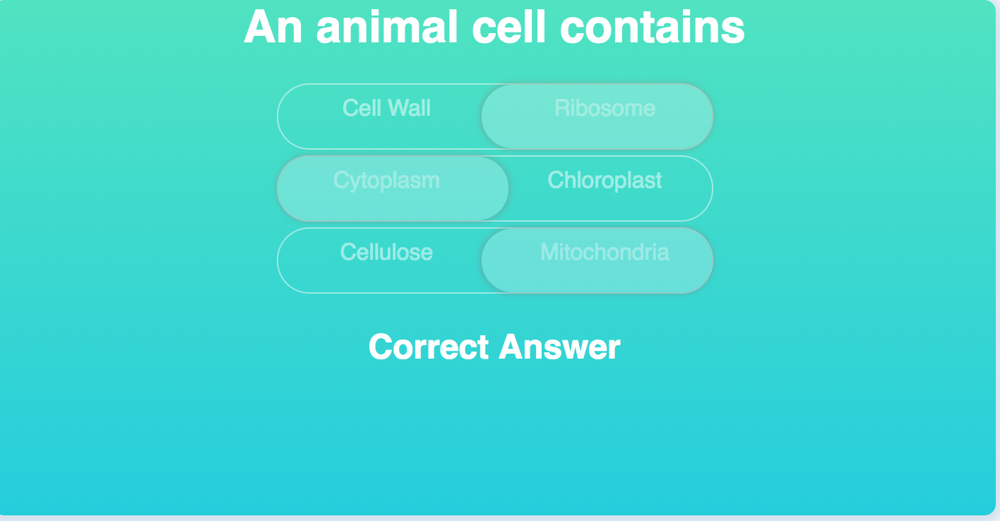

# React Question Component

## Challenge

To create a React Component that presents the user with a question and gives toggle options for the answer and will lock when correct.

## Approach

I tried to think about reusability and how the component could be used if the data for the question and answers was from a GET request and the response was in a json format. I succeeded in inputing the data in a way that was reusable with other data. However, the check to see if the answer is correct is not as easily modifiable, with more time this is the key aspect I would work on and make it automated. Also with more time I would have tested the component using jest to make sure any further modification or refactoring did not impact the functionality. The reason for not doing TDD on this occasion was due to the time restraints. I felt it may result in not being able to complete the task to do TDD.

#### To run the app on localhost:3000

```sh
$ git clone https://github.com/ajdavey8/react-question-component.git
$ cd react-question-component
$ npm install
$ npm start
```

#### Screenshots


